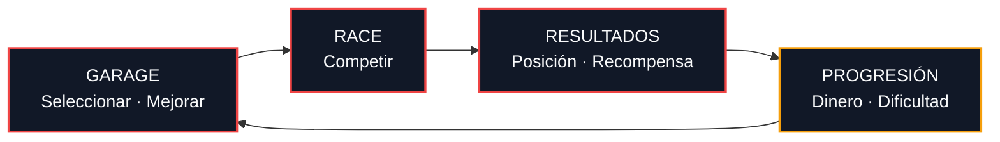
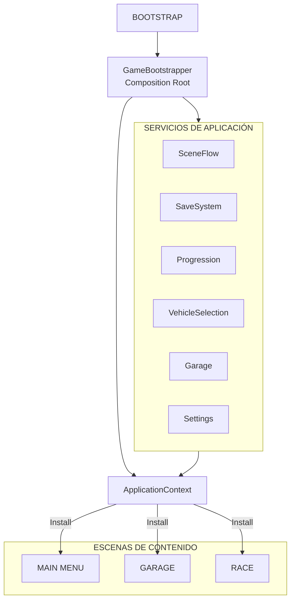
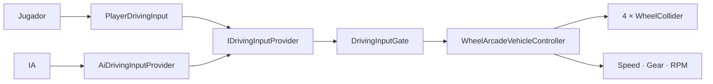
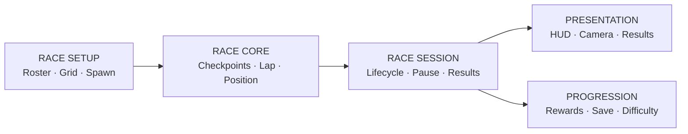
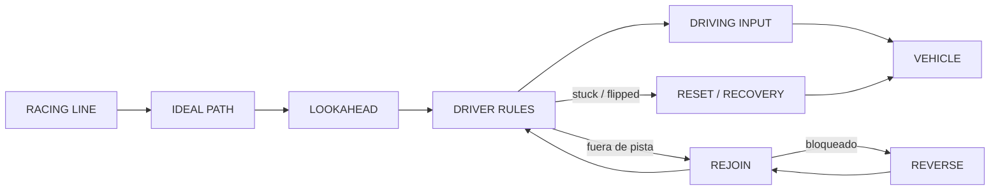
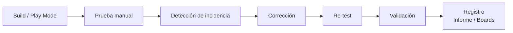

<div align="center">

# APEX RIVALS

**Juego de carreras arcade 3D con progresión de vehículos, mejoras y competencia contra un rival controlado por IA.**

<p>
  
  
  
  
  
  
</p>

**Binary Suns Studio · Proyecto individual universitario**

</div>

---

## Descripción

**Apex Rivals** es un juego de carreras arcade 3D para PC desarrollado en Unity 6. El proyecto busca ofrecer una conducción inmediata y accesible, con derrape, progresión de vehículo y una estructura de carrera completa de principio a fin.

La versión actual constituye un **demo jugable** con el siguiente flujo principal:

**Bootstrap → Main Menu → Garage → Race → Results**

La demo incluye selección de vehículo, mejoras de Engine y Handling, persistencia de progreso, configuración de aplicación, una carrera contra IA, HUD, pausa, resultados, recuperación del vehículo y soporte para teclado y gamepad Xbox-compatible.

### Estado actual

| Área | Alcance actual |
|---|---|
| Carrera | 1 circuito de producción · 1 vuelta · 1 rival IA |
| Vehículos | Starter · Vanguard · Striker |
| Mejoras | Engine · Handling |
| IA | Conducción experimental basada en Racing Line |
| Persistencia | Perfil JSON versionado con recuperación por backup |
| Input | Teclado + gamepad Xbox-compatible |
| Escenas | Bootstrap · MainMenu · Garage · Race |
| Motor | Unity 6000.3.5f2 |

---

## Contenido

- [Gameplay](#gameplay)
- [Características](#características)
- [Controles](#controles)
- [Correspondencia con el Parcial 1](#correspondencia-con-el-parcial-1)
- [Arquitectura](#arquitectura)
- [Arquitectura de carpetas](#arquitectura-de-carpetas)
- [Configuración](#configuración)
- [Testing](#testing)
- [Documentación](#documentación)
- [Tecnologías](#tecnologías)
- [Cómo ejecutar el proyecto](#cómo-ejecutar-el-proyecto)
- [Build](#build)
- [Decisiones de diseño e ingeniería](#decisiones-de-diseño-e-ingeniería)
- [Alcance actual](#alcance-actual)
- [Créditos](#créditos)

---

# Gameplay

Apex Rivals prioriza una **conducción arcade** por encima de una simulación realista. El vehículo utiliza `WheelCollider`, pero su comportamiento se ajusta mediante lógica propia de steering, drift, drivetrain, cámara y recuperación para conseguir una respuesta más directa.

El loop principal es:



**La IA se encuentra en una etapa experimental** y continuará siendo ajustada en futuras iteraciones, especialmente en conducción, comportamiento en curvas y recuperación.

---

# Características

| Categoría | Implementado |
|---|---|
| **Conducción** | Física arcade basada en WheelCollider, caja automática, reversa, drift, reset y recovery |
| **Cámara** | Cámara de seguimiento, comportamiento en drift y modo específico para reversa |
| **Carrera** | Countdown, checkpoints ordenados, vueltas, posición en vivo, finish y Results |
| **IA** | Rival experimental con seguimiento de Racing Line, lookahead, control de velocidad, rejoin y recovery |
| **Garage** | Selección de vehículo, preview, upgrades Engine/Handling y moneda |
| **Progresión** | Recompensas por posición |
| **Persistencia** | Save JSON versionado con archivo temporal y backup |
| **Settings** | Resolución, fullscreen y preferencias de audio |
| **UI** | Main Menu, Settings, Garage, HUD, Pause y Results |
| **Telemetría** | Velocidad, marcha y RPM |
| **Input** | Teclado y gamepad Xbox-compatible |

---

# Controles

| Acción | Teclado | Gamepad |
|---|---|---|
| Acelerar | `W` / `↑` | Right Trigger |
| Frenar / Reversa | `S` / `↓` | Left Trigger |
| Girar | `A` / `D` o `←` / `→` | Left Stick |
| Drift / Handbrake | `Space` | A / South |
| Reset | `R` | Y / North |
| Recovery del vehículo volcado | `E` | View / Select (⧉) |
| Pausa | `Esc` | Start |
| Navegación UI | Flechas / `WASD` | Left Stick / D-Pad |
| Confirmar | `Enter` / `Space` | A / South |
| Volver | `Esc` | B / East |
| Navegación de vehículos | `Q` / `E` | LB / RB |

> **Recovery:** si el vehículo queda volcado, presioná `E` en teclado o el botón **View / Select (⧉)** en un control Xbox —el botón pequeño ubicado a la izquierda del botón Xbox— para recuperar el vehículo.

---


# Correspondencia con el Parcial 1

Esta sección presenta **dónde puede consultarse cada requisito técnico del Parcial 1** dentro de Apex Rivals, con referencias al código, las escenas y la documentación correspondiente. Su objetivo es facilitar la navegación y revisión del proyecto.

| Punto del parcial | Implementación en Apex Rivals | Dónde verificarlo |
|---|---|---|
| **1. GameObjects, componentes y scripting básico** | Las escenas de producción utilizan GameObjects, componentes Unity y scripts `MonoBehaviour` para vehículo, carrera, UI, cámara y composición. | `Assets/ApexRivals/Scenes/`, `Vehicle/Runtime/`, `Race/Runtime/`, `UI/Runtime/` |
| **2. Organización del proyecto y GitHub** | Arquitectura modular por dominio, nombres descriptivos, separación entre Runtime/Configuration/Content y repositorio con historial de commits. | `Assets/ApexRivals/` e historial Git |
| **3. High Concept y propuesta de juego** | El concepto, género, objetivo, gameplay loop, alcance y planificación están documentados en el GDD, actualmente en desarrollo y sujeto a cambios durante la evolución del proyecto. | [GDD / High Concept](https://docs.google.com/document/d/1zPXWsrMvqy31KXZffFso6pOvwqyXkiLItkm2IwgrhvM/edit?tab=t.0) |
| **4. Controlador en tercera persona e Input** | Vehículo controlable mediante teclado/gamepad usando Unity Input System. `PlayerDrivingInput` produce el mismo contrato de conducción consumido por el runtime del vehículo. | `Input/Runtime/PlayerDrivingInput.cs`, `Vehicle/Runtime/WheelArcadeVehicleController.cs` |
| **5. Cámara funcional** | Cámara de seguimiento en tercera persona con comportamiento para velocidad, drift y reversa. | `Camera/Runtime/WheelVehicleFollowCamera.cs` |
| **6. Greyboxing / Blocking** | Circuito 3D cerrado con recorrido, salida/llegada, curvas, obstáculos y entorno de carrera. | `Scenes/Race.unity` y contenido visual utilizado por la escena |
| **7. Físicas, colisiones y triggers** | Rigidbody + WheelCollider para el vehículo; colliders de entorno; checkpoints mediante triggers ordenados. | `Vehicle/`, `Race/Runtime/`, `Race.unity` |
| **8. Prefabs e instanciación** | Vanguard y Striker son prefabs de producción. Race Setup instancia los vehículos del Player y AI al preparar la carrera. | `Vehicle/Prefabs/`, `RaceSetup/Runtime/` |
| **9. Raycast e interacción básica** | El sistema de recuperación utiliza un raycast para comprobar si el vehículo quedó volcado y si su techo está en contacto o demasiado próximo al suelo. Cuando se detecta ese estado, se habilita la recuperación manual mediante `E` o Xbox View. Una vez que el vehículo vuelve a una posición correcta y recupera contacto normal con el suelo, el estado de recuperación deja de estar activo. | `Vehicle/Runtime/VehicleRoofRecoveryDetector.cs` y sistema de reset/recovery |
| **10. Mecánica principal y estado del prototipo** | Conducción arcade + drift + competencia contra IA + checkpoints + finish + Results. | Flujo `Garage → Race → Results`, `Race/`, `RaceSession/` |

> La IA utilizada por la demo es **experimental**. Forma parte del contenido adicional del proyecto y no es necesaria para cumplir los requisitos mínimos del Parcial 1.

# Arquitectura

El código de producción se encuentra organizado en módulos dentro de `Assets/ApexRivals`, con responsabilidades separadas y una composición central de servicios desde Bootstrap.

## Arquitectura general



### Responsabilidad por módulo

| Módulo | Responsabilidad |
|---|---|
| `Bootstrap` | Inicio de aplicación y composición de servicios |
| `SceneFlow` | Estados y navegación entre escenas |
| `Vehicle` | Física, drivetrain, telemetría y reset |
| `Input` | Entrada del jugador y gating de conducción |
| `AI` | Conducción del rival y recovery |
| `Race` | Checkpoints, vueltas, posición y finish |
| `RaceSetup` | Roster, grid y spawning |
| `RaceSession` | Ciclo completo de una carrera |
| `Progression` | Moneda, recompensas y dificultad |
| `Garage` | Compra y aplicación de mejoras |
| `VehicleSelection` | Catálogo y vehículo seleccionado |
| `SaveSystem` | Persistencia y recuperación de perfil |
| `Settings` | Preferencias visuales y de audio |
| `Camera` | Cámara de seguimiento |
| `UI` | Presenter/View e installers de escena |

---

## Pipeline del vehículo

Player y AI comparten el mismo contrato de entrada:



De esta forma, el controlador del vehículo no necesita saber si está siendo conducido por el jugador o por la IA.

---

## Arquitectura de carrera



La lógica de carrera queda separada de la generación de vehículos, del ciclo de sesión y de la presentación.

---

## IA

La IA utiliza una conducción determinista basada en una `RacingLine`.



La IA intenta primero continuar la trayectoria, luego reincorporarse y solo utiliza reset cuando el vehículo realmente queda bloqueado o volcado.

---

# Arquitectura de carpetas

La organización del proyecto sigue una estructura **modular por dominio**. Cada sistema mantiene sus responsabilidades separadas y, cuando corresponde, distingue entre código de runtime, configuración, contenido serializado y presentación.

```text
ApexRivals/
├── Assets/
│   └── ApexRivals/
│       │
│       ├── ApexRivals.Runtime.asmdef
│       │   └── Assembly principal del código de producción.
│       │
│       ├── AI/
│       │   ├── Configuration/
│       │   │   └── Configuración y tuning del rival experimental.
│       │   └── Runtime/
│       │       ├── AiDrivingInputProvider
│       │       ├── AiDriverRules / AiDriverTuning
│       │       ├── IdealRacingPath / IdealRacingDriverRules
│       │       ├── RacingLine
│       │       └── Rejoin, reverse y recovery de IA.
│       │
│       ├── Art/
│       │   └── Materiales y contenido visual utilizado por producción.
│       │
│       ├── Audio/
│       │   └── Espacio reservado para contenido y configuración de audio.
│       │
│       ├── Bootstrap/
│       │   └── Runtime/
│       │       ├── GameBootstrapper
│       │       ├── ApplicationContext
│       │       ├── ApplicationBootstrapService
│       │       └── IContentSceneInstaller
│       │
│       ├── Camera/
│       │   └── Runtime/
│       │       └── WheelVehicleFollowCamera
│       │
│       ├── Content/
│       │   └── Configuration/
│       │       ├── AI/
│       │       ├── Progression/
│       │       ├── SceneFlow/
│       │       ├── Upgrades/
│       │       └── Vehicles/
│       │
│       ├── Garage/
│       │   ├── Configuration/
│       │   │   └── Definiciones de Engine y Handling.
│       │   └── Runtime/
│       │       ├── GarageService
│       │       ├── cálculo de stats efectivos
│       │       └── compra/aplicación de upgrades.
│       │
│       ├── Input/
│       │   └── Runtime/
│       │       ├── PlayerDrivingInput
│       │       ├── DrivingInput
│       │       ├── IDrivingInputProvider
│       │       └── DrivingInputGate
│       │
│       ├── Progression/
│       │   ├── Configuration/
│       │   │   ├── RaceProgressionDefinition
│       │   │   └── RaceProgressionTierDefinition
│       │   └── Runtime/
│       │       ├── PlayerProgressionState
│       │       ├── RaceRewardService
│       │       └── servicios/valores de progresión.
│       │
│       ├── Race/
│       │   ├── Configuration/
│       │   │   └── Definiciones de la carrera.
│       │   └── Runtime/
│       │       ├── RaceCoordinator
│       │       ├── RaceParticipant
│       │       ├── checkpoints y progreso
│       │       ├── lap / finish
│       │       ├── ordering / position
│       │       └── eventos y resultados.
│       │
│       ├── RaceSetup/
│       │   ├── Configuration/
│       │   │   └── Roster y configuración de la demo.
│       │   └── Runtime/
│       │       ├── RaceSetupService
│       │       ├── StartingGrid
│       │       ├── spawning/factory
│       │       └── RaceVehicleComposition
│       │
│       ├── RaceSession/
│       │   └── Runtime/
│       │       ├── RaceSessionCoordinator
│       │       ├── lifecycle de la carrera
│       │       ├── pause/resume
│       │       └── handoff a Results / reward / save.
│       │
│       ├── SaveSystem/
│       │   └── Runtime/
│       │       ├── PlayerProfileSaveService
│       │       ├── PlayerProfileSaveData
│       │       ├── validación de schema
│       │       └── primary / tmp / backup recovery.
│       │
│       ├── SceneFlow/
│       │   ├── Configuration/
│       │   │   └── SceneFlowConfiguration
│       │   └── Runtime/
│       │       ├── SceneFlowService
│       │       ├── ApplicationState
│       │       ├── UnityContentSceneLoader
│       │       └── transición entre escenas.
│       │
│       ├── Scenes/
│       │   ├── Bootstrap.unity
│       │   ├── MainMenu.unity
│       │   ├── Garage.unity
│       │   └── Race.unity
│       │
│       ├── Settings/
│       │   └── Runtime/
│       │       ├── SettingsService
│       │       ├── SettingsState
│       │       ├── PlayerPrefsSettingsStorage
│       │       └── resolución / fullscreen / audio preferences.
│       │
│       ├── Tests/
│       │   ├── EditMode/
│       │   │   └── Tests de reglas, servicios y lógica aislada.
│       │   └── PlayMode/
│       │       └── Tests que requieren contexto de ejecución Unity.
│       │
│       ├── UI/
│       │   └── Runtime/
│       │       ├── Main Menu
│       │       ├── Settings
│       │       ├── Vehicle Selection
│       │       ├── Garage
│       │       ├── Race HUD
│       │       ├── Pause
│       │       ├── Results
│       │       ├── Presenter / View contracts
│       │       └── scene installers / focus / navigation.
│       │
│       ├── Vehicle/
│       │   ├── Configuration/
│       │   │   ├── WheelVehicleConfiguration
│       │   │   ├── Vanguard configuration
│       │   │   └── Striker configuration
│       │   ├── Prefabs/
│       │   │   ├── Vanguard
│       │   │   └── Striker
│       │   └── Runtime/
│       │       ├── WheelArcadeVehicleController
│       │       ├── drivetrain
│       │       ├── steering / friction / drift
│       │       ├── VehicleResetter
│       │       ├── VehicleRoofRecoveryDetector
│       │       └── IVehicleTelemetry
│       │
│       └── VehicleSelection/
│           ├── Configuration/
│           │   └── VehicleCatalogDefinition / VehicleDefinition
│           └── Runtime/
│               ├── VehicleCatalog
│               ├── SelectedVehicleState
│               └── VehicleSelectionService
│
├── Packages/
│   └── Dependencias de Unity declaradas por el proyecto.
│
└── ProjectSettings/
    ├── Build Settings / escenas de producción
    ├── Input System
    └── configuración general del proyecto Unity.
```

## Convenciones de organización

La estructura aplica varias reglas para mantener el proyecto legible:

- **Dominio primero:** cada sistema (`Race`, `Vehicle`, `Garage`, etc.) posee su propia carpeta.
- **`Runtime/`:** contiene comportamiento ejecutable y contratos del dominio.
- **`Configuration/`:** contiene tipos destinados a configuración y datos authored.
- **`Content/Configuration/`:** centraliza los assets concretos utilizados por la demo.
- **`Scenes/`:** contiene únicamente las escenas de producción.
- **`Tests/EditMode` y `Tests/PlayMode`:** mantienen las pruebas fuera del runtime de producción.
- **Un tipo público principal por archivo:** facilita navegación, revisión y mantenimiento.
- **Composición centralizada:** las escenas reciben servicios desde `ApplicationContext` mediante installers, evitando construir sistemas paralelos.


# Configuración

Gran parte del comportamiento del juego se define mediante assets de configuración.

| Configuración | Responsabilidad |
|---|---|
| `VehicleCatalogDefinition` | Catálogo y vehículos disponibles |
| `WheelVehicleConfiguration` | Física y tuning del vehículo |
| `UpgradeDefinition` | Costos y modificadores de Engine/Handling |
| `RaceRewardDefinition` | Recompensas por posición |
| `AiDriverConfiguration` | Configuración y tuning experimental de la IA |
| `RaceDefinition` | Parámetros de carrera |
| `SceneFlowConfiguration` | Mapeo de escenas |

---

# Testing

El proyecto incluye pruebas **Edit Mode** y **Play Mode** utilizando Unity Test Framework.

Las pruebas cubren, entre otros:

- conducción y drivetrain;
- IA y recovery;
- checkpoints y vueltas;
- race setup y race session;
- progression y rewards;
- Garage y upgrades;
- SaveSystem;
- SceneFlow;
- Settings;
- VehicleSelection;
- UI y navegación.

Además, durante el desarrollo se registraron incidencias y correcciones mediante Azure Boards.

---


## Flujo de testing

El proceso de prueba utilizado durante el desarrollo sigue un ciclo simple de detección, corrección y nueva validación:



## Cobertura funcional del testing

| Área | Estado |
|---|---|
| Conducción | ✅ Verificada |
| Cámara | ✅ Verificada |
| Colisiones | ✅ Verificada |
| Carrera | ✅ Verificada |
| Garage | ✅ Verificada |
| Persistencia | ✅ Verificada |
| UI | ✅ Verificada |
| IA | ⚠️ Experimental |

> La tabla representa las áreas funcionales revisadas durante esta etapa del prototipo. La IA continúa en desarrollo y su comportamiento se considera experimental.


# Documentación

La documentación académica del proyecto se encuentra disponible en los siguientes documentos:

- **GDD / High Concept**  
  https://docs.google.com/document/d/1zPXWsrMvqy31KXZffFso6pOvwqyXkiLItkm2IwgrhvM/edit?tab=t.0

- **Primer Informe de Testing**  
  https://docs.google.com/document/d/1anv26JgDTKbWAdL3dPm-19dqLIJ12hSMi97pQU_WaTk/edit?usp=sharing

> Ambos documentos forman parte de la documentación de la primera entrega de Motores de Desarrollo I.

---

# Tecnologías

| Categoría | Tecnología |
|---|---|
| Motor | Unity **6000.3.5f2** |
| Lenguaje | C# |
| Render | Universal Render Pipeline **17.3.0** |
| Input | Unity Input System **1.17.0** |
| Física vehicular | Unity `WheelCollider` |
| UI | Unity UI / uGUI **2.0.0** |
| Testing | Unity Test Framework **1.6.0** |
| Modelado de entorno | ProBuilder **6.0.9** |
| Plataforma | Windows PC |

---

# Cómo ejecutar el proyecto

### Requisitos

- Unity Hub
- Unity **6000.3.5f2**
- Windows

### Clonar

```bash
git clone https://github.com/EmilianoBazanZapata/ApexRivals.git
```

Después:

1. abrir la carpeta `ApexRivals` desde Unity Hub;
2. esperar a que Unity importe assets y packages;
3. abrir `Assets/ApexRivals/Scenes/Bootstrap.unity`;
4. presionar **Play**.

Bootstrap inicializa el perfil, settings y servicios antes de ingresar al Main Menu.

---

# Build

El orden de escenas de producción es:

1. `Bootstrap`
2. `MainMenu`
3. `Garage`
4. `Race`

`Bootstrap` debe permanecer como primera escena, ya que crea los servicios utilizados por las escenas de contenido.

---

# Decisiones de diseño e ingeniería

### Un mismo contrato para Player y AI

El vehículo consume `IDrivingInputProvider`, por lo que Player y AI pueden controlar el mismo runtime sin duplicar lógica.

### Composición explícita

`GameBootstrapper` construye los servicios de aplicación y los expone mediante `ApplicationContext`.

### Race Core separado del resto

Las reglas de carrera, el setup, la sesión y la presentación están separadas para mantener responsabilidades claras.

### IA experimental

El rival controlado por IA utiliza una implementación experimental basada en Racing Line y reglas configurables. Su comportamiento continuará siendo ajustado en futuras iteraciones.

### Configuración separada del runtime

Vehículos, upgrades, IA, recompensas y parámetros de carrera se definen mediante assets de configuración.

### Presentación desacoplada

La UI utiliza Presenter/View para mantener la lógica de presentación separada de uGUI.

### Persistencia con recuperación

El perfil utiliza esquema versionado, archivo temporal y backup para reducir el riesgo de pérdida de progreso.

---

# Alcance actual

Apex Rivals es actualmente un **DEMO**, no un juego completo.

La versión jugable contiene:

- 1 circuito de producción;
- 1 vuelta por carrera en la demo actual;
- 1 rival controlado por una IA experimental;
- 3 definiciones de vehículo;
- upgrades Engine y Handling;
- recompensas por posición;
- Main Menu;
- Settings;
- Garage;
- Race HUD;
- Pause;
- Results;
- Save/Load.

El proyecto está preparado para ampliar progresivamente el número de vehículos y opciones de mejora.

---

# Créditos

**Apex Rivals** fue diseñado y desarrollado por **Emiliano Bazán-Zapata** bajo el nombre **Binary Suns Studio**, como proyecto individual para la materia **Motores de Desarrollo I** de la Tecnicatura Universitaria en Desarrollo y Producción de Videojuegos.

Universidad Tecnológica Nacional — Facultad Regional Buenos Aires.

